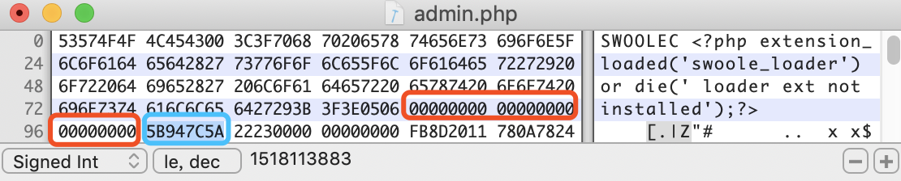
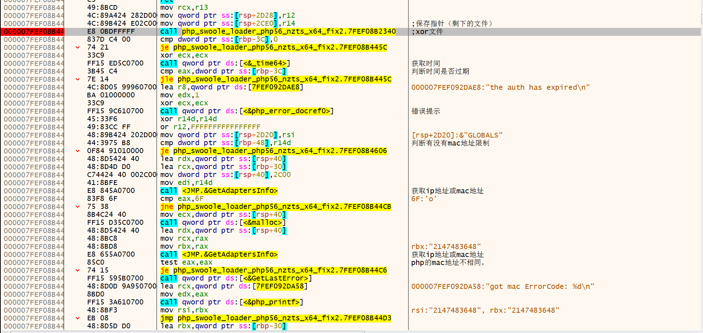

# Swoole-Decoder
还原Swoole处理后的php代码

## 对于各类授权，mac处理
前面是授权，地址，最后是时间戳，这里是5b947c5a


## 对于文件解密
首先查看其长度这里是 0x2322，

一直到22230000 0000000 ，后面才是有效的opcode结构体。
脚本如下：
``` php
<?php 
$filename = "./admin.php";
$body = file_get_contents($filename);
$body = substr($body,112,strlen($body));
$str = sprintf("&(( %d (*&",strlen($body));
$str = str_pad($str,19,"\x00");
$sha1 = sha1($str);
$xor="*&(*^(*@NLwoJL(@*&&)*)35$(&#)*@)(@&guo$)(@*)JLshiJJLKSJD(&)(*)(*)";

$table[] = array();
for ($index = 0,$j_index=0; $j_index < strlen($xor); $j_index++,$index++) {
    if($index == strlen($sha1)  ){
        $index = 0 ;
    }
     $table[$j_index]= $sha1[$index] ^ $xor[$j_index];
}
for ($i=0,$j=0; $j < strlen($body); $j++,$i++) { 
    if($i == 0x40  ){
        $i = 0;
    }
    $body[$j] = $table[$i] ^ $body[$j];
}
file_put_contents($filename.".sw.php",$body);
?>
```


## 对于函数名计算替换如下
``` php
    $r8 = 0x1505;
    for( $i=0; $i < strlen($name) ; $i++){
        $r8 = ord($name[$i]) + $r8 * 0x21;
        $r8 =  $r8 & 0xFFFFFFFF;
    }
    $encode_str2 = sprintf("_%u",$r8);
    $r8 = 0x1505;
    for( $i=0; $i < strlen($encode_str2) ; $i++){
        $r8 = ord($encode_str2[$i]) + $r8 * 0x21;
        $r8 =  $r8 & 0xFFFFFFFF;
    }
    $result = sprintf("_%u",$r8);

```

### 免费版
测试了免费版，通过xor 解开文件后可获取到zend_op_array，但是其中的opcode已经被抹去，不过还可以通过handlers来还原代码。但是无法确定商业版有什么改变。